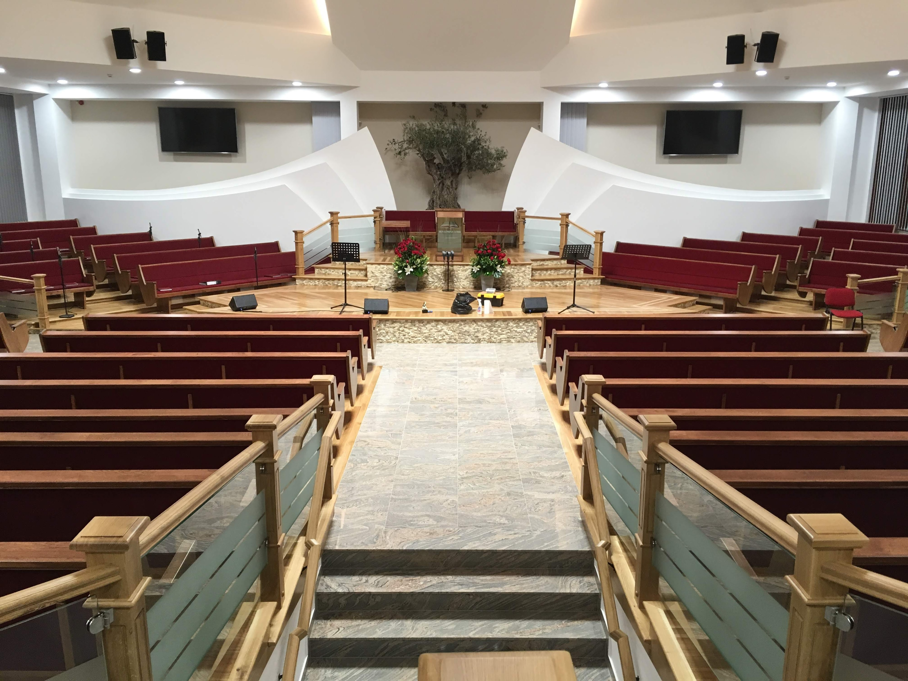

# Talantul în Negoț 2026 – County Stage Event Platform

Official event management platform for the 2026 county-level "Talantul în Negoț" Bible competition in Bistrița-Năsăud, Romania. This web application served as the central information hub for hundreds of participants, providing real-time room allocations, schedules, and live updates.



## 🚀 Key Features

- **Real-time Participant Search:** Searchable database for room and seat assignments, powered by Google Sheets.
- **Dynamic Event Schedule:** Interactive timeline of the competition's activities.
- **Live Stream Integration:** Embedded YouTube broadcast for remote viewing.
- **Automatic Resource Release:** Time-gated release of competition keys (Barem) and results.
- **Photo Gallery:** Integrated media preview for event highlights.
- **Responsive Design:** Optimized for mobile-first usage during the event day.

## 🛠️ Technical Stack

- **Framework:** [Next.js 14](https://nextjs.org/) (App Router)
- **Styling:** [Tailwind CSS](https://tailwindcss.com/)
- **Data Source:** [Google Sheets API](https://developers.google.com/sheets/api) (Lightweight CSV-based CMS)
- **Deployment:** [Vercel](https://vercel.com/)
- **Analytics:** Vercel Analytics & Speed Insights

## 🏗️ Architecture: Google Sheets as a CMS

To ensure the organizers could update participant data without technical knowledge, the application uses **Google Sheets as a serverless CMS**. 

1. **Easy Management:** Organizers update names and seat numbers in a shared spreadsheet.
2. **Server-Side Fetching:** The Next.js backend fetches the data via CSV export for maximum performance and simplicity.
3. **Caching Strategy:** Implemented a short-lived cache (60s TTL) to minimize redundant network requests while keeping data fresh during peak traffic.

## 💻 Local Setup

1. **Clone the repository:**
   ```bash
   git clone <your-repo-url>
   cd talant-2026-beclean
   ```

2. **Install dependencies:**
   ```bash
   npm install
   ```

3. **Environment Configuration:**
   Create a `.env.local` file in the root directory:
   ```env
   SHEET_ID=your_google_sheet_id_here
   ```

4. **Run the development server:**
   ```bash
   npm run dev
   ```
   Open [http://localhost:3000](http://localhost:3000) to see the result.

## 📖 Project Structure

```text
├── app/
│   ├── api/search/    # Backend endpoint for participant lookup
│   ├── barem/         # Correction key release page
│   ├── cautare/       # Room allocation search interface
│   ├── live/          # Live stream integration
│   ├── locatii/       # Event maps and addresses
│   └── program/       # Event timeline
├── components/        # Reusable UI components (Navbar, Footer, etc.)
├── lib/               # Shared logic (Google Sheets integration)
├── public/            # Static assets and event documents
└── tailwind.config.js # Custom theme (Navy & Gold)
```

## 🌟 Portfolio Context

This project demonstrates my ability to:
- Deliver a production-ready application for a high-traffic event.
- Implement creative solutions for non-technical stakeholders (Google Sheets CMS).
- Optimize for performance and mobile responsiveness.
- Manage full-stack development using modern React patterns and server-side logic.

---

*Note: This project was developed for the Pentecostal Church No. 1 Beclean as part of the regional Bible competition organization.*
